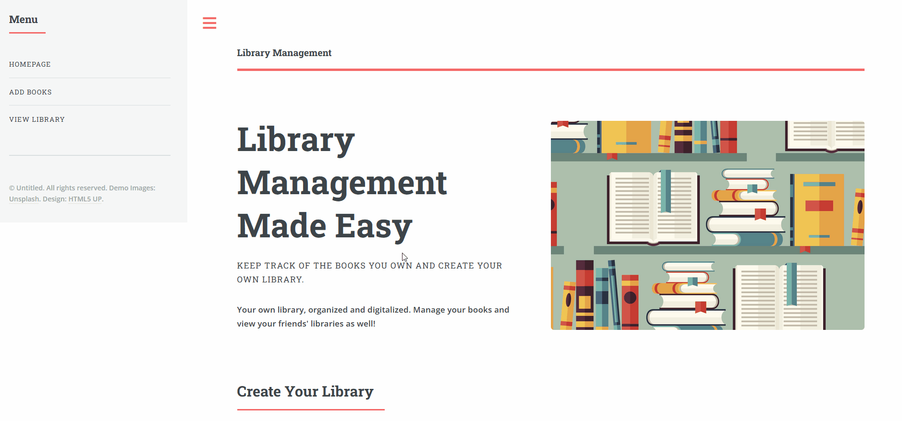

# BookBase
Responsive website to manage your bookshelf library

Library Management Made Easy
Overview

Welcome to Library Management Made Easy! This project is designed to help you keep track of the books you own and manage your personal library. With this application, you can organize and digitalize your book collection effortlessly. 

Features:
- **Book Management**: Easily add, remove, and search for books within your library.
- **OOP Concepts**: The project is built using Object-Oriented Programming (OOP) principles in JavaScript, ensuring a modular and maintainable codebase.
- **Interactive UI**: Built with HTML/CSS for a clean and user-friendly interface.
- **Local Storage**: Your library data is saved in your browser's local storage, so your collection is persistent across sessions.
- **Responsive Design**: Access your library on any device, thanks to a responsive design.

Getting Started
To get started with this project, simply clone the repository and open the index.html file in your browser.

bash
git clone https://github.com/Hailo7ts/Library.git
cd library-management

Usage:
- **Add Books**: Enter the title and author in the provided fields to add new books      to your library.
- **Manage Your Collection**:
  - View all available books.
  - Remove books you no longer own from your library.
- **Automatic Saving**: Your library is automatically saved in your browser's local      storage, ensuring your collection is ready whenever you return.
  
 Optimizations:
 - Not only can you manage your own library, but you can also view your friends'        libraries, making it easier to share and discover new books.
 - Search for specific titles or authors within your collection.

Technologies Used:
- **JavaScript**: Handles the logic and interaction of the application, utilizing Object-Oriented Programming (OOP) principles for a modular and maintainable codebase.
- **HTML/CSS**: Provides the structure and styling of the web pages, ensuring a clean and user-friendly interface.
